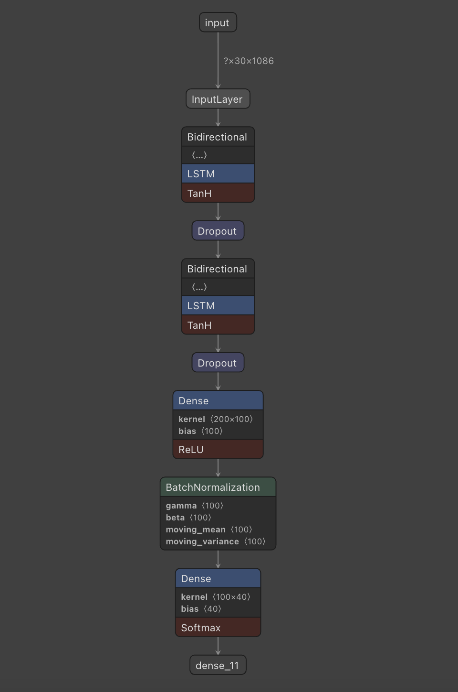
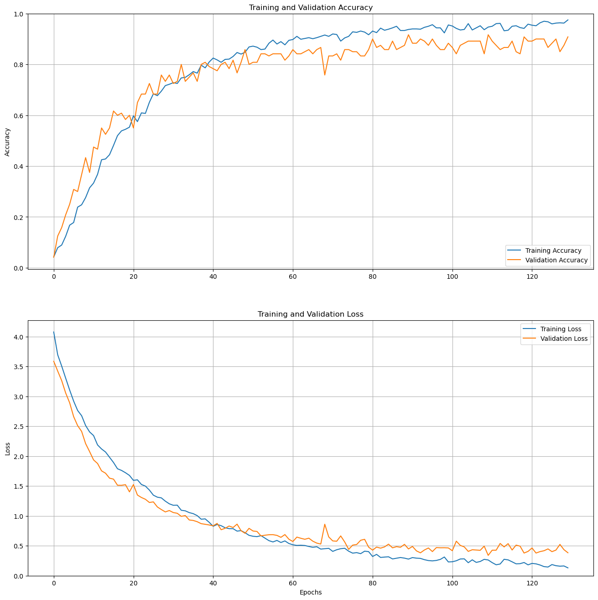

Sign Language Classification - Training with Custom Dataset
============================================================================================

This repository provides a complete guide into how to install and employ a sign language classification model, which was developed in the website SignLingo. There were several attempts regarding the training AI model process. As a result, by researching into ViVit, LStM model, our team concluded to the use of LSTM model(Long short-term memory networks)

## 1. Introduction:

The Sign Languge Classification model is an Artificial Intelligence software designed to help recognize and classify sign language gestures for the deaf community. This report describes the development and evaluation process of the LSTM model, trained using the VGG architecture, achieving an accuracy of 94.5% in recognizing 40 different sign language classes.

## 2. Characteristics of Sign Language for Deaf Students:

Sign language is a distinctive means of communication for the deaf. Deaf students in elementary schools in Vietnam often use sign language as a primary tool for communication and learning. However, sign languages in Vietnam are not standardized accurately, leading to the use of many spontaneously created signs combined with random gestures to convey meaning, resulting in inaccuracies and difficulties in information transmission.

## 3. The Role of Language Forms in the Learning of Deaf Students:

Elementary school deaf students tend to use individual signs without forming sentences or adhering to sign language conventions. However, these students have the ability to adapt and learn sign language conventions in Vietnam easily, reducing misunderstandings between spontaneous signs and conventional signs. Gestures also play a vital role in the thinking process of deaf students, helping them perceive and understand the world around them.

## 4. Significance and Applications of the Sign Language Classification Model:

The SLC model is constructed and trained with the VGG architecture to recognize and classify sign language gestures, improving communication and interaction for the deaf community. Developing this model from an early age helps children establish relationships with others and develop thinking skills. The SLC model also supports the education process of the deaf in line with United Nations recommendations and the World Federation of the Deaf.

## 5. Conclusion:

The Sign Language Classification Model is a useful application that enhances communication and interaction for the deaf community, especially elementary school deaf students in Vietnam. The VGG architecture has provided an accuracy of 94.5% in recognizing 27 sign language classes, demonstrating the effectiveness and potential of this model. The development and application of the SLC model bring significant benefits to the deaf community, contributing to an improved quality of life and education for them.

The journey to Back-end developments
============================================================================================

## 1.LSTM 

- Long Short-Term Memory (LSTM) is a type of recurrent neural network (RNN) architecture designed to work with sequences of data. LSTMs are particularly well-suited for tasks involving time series data, natural language processing (NLP), speech recognition, and more, where information from the past needs to be remembered and integrated into future predictions.

- LSTMs are an improvement over traditional RNNs because they address the vanishing gradient problem, which is a common issue with standard RNNs. In the vanishing gradient problem, the gradients (derivatives used in training) become very small as they are back-propagated through time steps, leading to slow or stalled learning. LSTMs overcome this problem through the use of specialized gating mechanisms.

## 2.Video Transfomer 

- "Video Transformer" generally refers to a class of deep learning models that apply the Transformer architecture to video data. The Transformer architecture, initially designed for natural language processing tasks, has been adapted and extended to various other domains, including computer vision and video analysis.

- A Video Transformer, in the context of deep learning, is designed to process video sequences, taking into account both spatial and temporal information. Here are some key aspects and applications of Video Transformers:

Our problems regarding Back-end development 
============================================================================================

## 1. Dataset:

- In this day and age, there is a wide variety of American Sign Language Datasets, namely WLASL(World-level American Sign Language). However, our team aimed to help deaf Vietnameses, causing the lack of Vietnamese sign language dataset in order to successfully train the AI-model. As a result, the team decided to create our own dataset, containing 1200 videos for 40 classes. 

## 2. LSTM model

- Causes: 

Starting with Long short-term memory classification model, due to  limited knowledge when it comes to preprocessing data, we processed the data to the point that the model cannot understand the pattern and trend in almost every classes, leading to extremely high validation loss and dramatically low validation accuracy.

- Solution: 

After several meetings with the team and multiple voting sessions, we decided to switch to another model architecture in hopes of changing the current circumstances. Consequently, we found the state-of-the-art NLA-SLR repository. Moreover, we took a novel approach to take one-time series( one frame in thirty frames video) as an anchor and sclaed the remainging timeseries according to the anchor, which showed adquate outocmes, but it lacked in terms of accuracy.  

## 3. NLA-SLR

- The NLA-SLR github repository made by a Chinese college student provided extremely promising methods to how to detect and classify sign languages most effectively. However, due to its adavanced academic language and knowldege, we could not apply the model architecture to use it with our dataset. After several days attempting to utilize the research, we once again failed and had to find a different approach. 

## 4. Video Transformer Model

- Causes : 

From when the team initiated the new method, Hackers focused on studying how it works and what parameters does it require. The process despite being arduous and complicated, we managed to train the model to our own dataset. However, as we did not have the high-end computers with resourceful GPUs, we did not have the potential to continue on training with the overload of memory. 

- Solution:

Nevertheless, we have found another way to train the AI model. Discovering that we can use one of the super-computers from Google, the back-end developers decided to purchase more computing units and memory to handle the workload of the data. Not only that, realising that when the real-life data trained on Video Transformer model was not efficient and brought low outcomes, we devised a method to use MediaPipe Holistic to generate keypoints from left hand, right hand, and pose and displayed the total keypoints to a black background in order to accomodate for the use on Vivit architecture. Consequently, the team successfully trained the data and produced promising results with 90 percent accuracy and 50 percent loss, which was quite decent.

## 5. LSTM(for the second time)

- After visting our AI mentors, the team has been advised to once again retry the method of Long short-term memory because it is extremely inefficient to run with Video Transformer with such limited dimensions on the data. As a result, we ultimately decided on the option of implementing LSTM to our Sign Language Website as it is the most efficient and effective for the process of natural sign language classification. In the end, we use LSTM to finalize AI production

## 6. Conclusion

After various attempts to maximise the potential of detecting and translating sign languages, although we have encountered several problems and major issues, there were so much for the team to learn. For example, the team learned the complexity and the difficulty of connecting APIs with front-end and back-end softwares, namely the deployment of the model to the website and the connection of Clouds to store users' information such as usernames and passwords.

Furthermore, the developers learned specific skillsets regarding their specific fields. For instance, as training model is in need of extra accelerators such as GPUs, one of the team members learned run GPU on tensorflow. In addition, another member managed to store users' data on cloud, and if one forgot his password, the website would automatically send the password to the user's email

We also obtained, without the help of any professionals, profound knowledge on two model architectures, Video Transfomers and Long short-term memory, as young individuals studying at schools.  

Even though we wasted a large proportion of time on researching AI models, this experience was extremely meaningful as we experienced the workload of a programmers and obtained useful information. 

# Signlingo-Steamhack2023
 ## How to run the website
Clone github repository by pasting this line into your device terminal
```
git clone https://github.com/tom1209-netizen/Signlingo-Website.git
```
Move to cloned directory
```
cd Signlingo-Website
```
Create an virtual enviroment 
```
python -m venv <name_of_virtualenv>
```
Activate the enviroment  
**Note that you have to use different code depending on your device os**  

For **Macos** use  

```
source <name_of_virtualenv>/bin/activate
```
For **Windows** use
```
source <name_of_virtualenv>\Scripts\activate
```

Install all neccessary libraries
```
pip install -r requirements.txt  
```

Run the server backend flask python
```
flask run
```

# Model
Accuracy on test set: 90%
Loss on test set: 33%
## Model architecture



## Visualize accuracy and loss




## Confusion matrix


